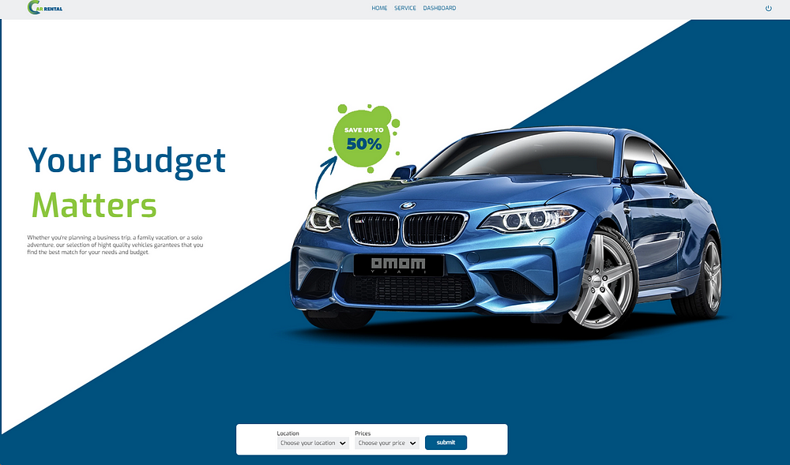
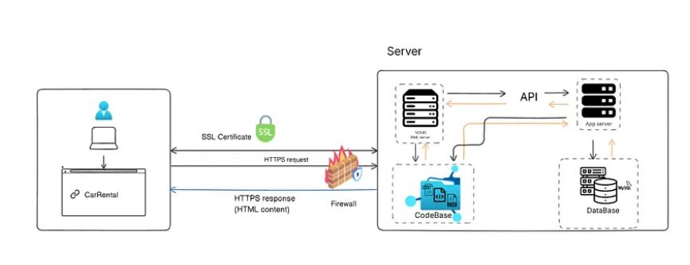
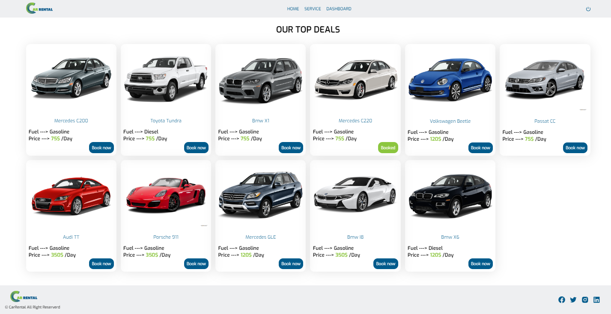

# CarRental


Welcome to CarRentalApp, a web application designed to streamline the car rental process. This platform offers a user-friendly interface for customers to browse, reserve, and rent vehicles with ease.

- Deployed Application : [CarRental](https://car-rent.tech/) 
- Project Blog Article : [Blog](https://medium.com/@youness.merzak123/welcome-to-carrental-web-application-badfa48a31c6)

- Authors' LinkedIn Profiles: 
 				 Youness Merzak - [Linkedin]( https://www.linkedin.com/in/youness-merzak-084aa41a3/)
         Leila Merzak - [Linkedin](https://www.linkedin.com/in/leila-merzak-797701197/)

## The Solution Architecture


## Tips

To manage Python versions and isolate project dependencies we recommended to create a new virtual environment named venv, a directory that contains a Python installation for a particular version of Python.
To do that follow these steps :

```bash
sudo apt update
sudo apt install python3.8
sudo apt-get install python3.8-venv
python3 -m venv venv 
source venv/bin/activate
```

## Installation
To set up CarRentalApp on your local machine:

```bash
  git clone [Repository URL]
  cd CarRental
  ./requirements.sh
```
To configure your database for testing, There are two options, follow the instructions below based on the option you choose:

1. Using Existing SQL File Configuration: 
If your working with the mysql_dev.sql in the directory, execute the following command to fill your database with test data:
```bash
cat mysql_dev.sql | sudo mysql
MYSQL_USER=user_dev MYSQL_PWD=yourpassword MYSQL_HOST=localhost MYSQL_DB=car_dev_db ./main.py
```
2. Custom Configuration: 
If you have a different database configuration, modify the command with your specific details. 
```bash
MYSQL_USER=[YourUsername] MYSQL_PWD=[YourPassword]MYSQL_HOST=localhost MYSQL_DB=car_dev_db ./main.py
```
    
## Usage/Examples

1. In a container run a command to start your api
```bash

MYSQL_USER=user_dev MYSQL_PWD=yourpassword MYSQL_HOST=localhost MYSQL_DB=car_dev_db python3 -m api.v1.app

```
2. In a new container run a command to launch your webServer locally

Run a command in a new container:

```bash
MYSQL_USER=user_dev MYSQL_PWD=yourpassword MYSQL_HOST=localhost MYSQL_DB=car_dev_db python3 -m web_dynamic.car-flask

```
3. Type http://127.0.0.1:5000/ in your Browser and enjoy testing.

4. Make sure to expose port 5000 and 5001 if you are using a VM machine, for example if you are using Vagrant:
In your Vagrantfile add this :
```bash
config.vm.network :forwarded_port, guest: 5001, host: 5001
config.vm.network :forwarded_port, guest: 5000, host: 5000
```
## Features of this web application
- Vehicle Selection and Availability Interface: 
the web application offer a comprehensive and user-friendly interface for selecting and viewing the availability of vehicles.
- User Authentication: This feature involves creating a secure login process where users can sign up and sign in using their email addresses, in order to book a car which will be added in their dashboard.

## Licensing
This project is licensed under the MIT License.
## Want to Contribute?
Feel free to send pull requests and raise issues.

